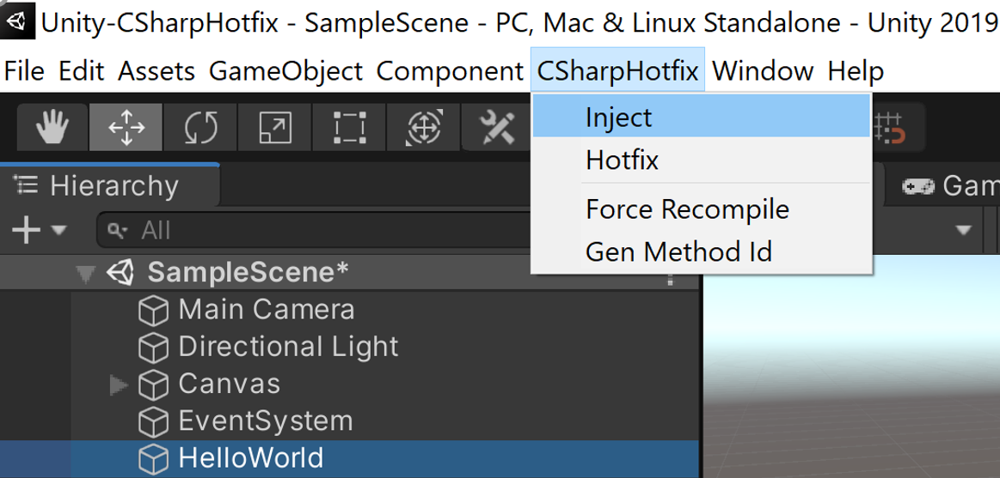

# Unity-CSharpHotfix

A tool support modify c# code when Unity is playing.


## How to Use

### Hello World
create a new game object:   


create new script named "HelloWorld.cs" and attach it to the game object created before: 
``` csharp
using System.Collections;
using System.Collections.Generic;
using UnityEngine;

public class HelloWorld : MonoBehaviour
{
    void Start()
    {
        Debug.Log("Hello World");
    }
}

```

### First Run
run game, you will see "Hello World" in the console:  
  

### Inject Dll
we need inject dll to mark method can hotfix, to do this, in non-play mode, click:  
Unity Toolbar -> CSharpHotfix -> Inject  



### Create Hotfix 
when playing game, copy "HelloWorld.cs" to path: 
```YOUR_PROJECT/CSharpHotfix/Code/HelloWorld.cs```

and modify it: 
``` csharp
using System.Collections;
using System.Collections.Generic;
using UnityEngine;

public class HelloWorld : MonoBehaviour
{
    void Start()
    {
        Debug.Log("Hello World (hotfixed)");
    }
}
```

### Use Hotfix
Unity Toolbar -> CSharpHotfix -> Hotfix:


### See Result
duplicate "HelloWorld" gameobject in the hierarchy (or copy & paste it), it will create a new gameobject:   
  

and you will see "Hello World (hotfixed)" in the console:  
  

## How to Use in Other Project
Copy ```YOUR_PROJECT/Assets/Scripts/CSharpHotfix``` and ```YOUR_PROJECT/CSharpHotfix``` folder to your Unity project.  
* ```YOUR_PROJECT/Assets/Scripts/CSharpHotfix```: stores test cases, editor entry, config files.  
* ```YOUR_PROJECT/CSharpHotfix```: stores hotfix tool exe, code files to hotfix.


## Limitations
There're many limitations when use this tool: 

### Cannot Debug
as we will modify the .dll files when enable tool, you can't debug after then.  
For example, break points in visual studio will never been triggered. 

### Only Support Method 
you can only hotfix method which is already declared in old c# codes. new class/methd/member will be ignored.

### Bugs
as a simple tool just created for testing, it hasn't been test enough. 

## Run Tests
we have a few simple test cases included, just click the "Run Tests" button in SampleScene, you can see the different result before and after hotfix.  

### Before Hotfix
  

### After Hotfix
  

### Add new test cases
#### create test
if you need add new test cases, just create files to path: 
```Assets/CSharpHotfix/Tests/```  
and  
```YOUR_PROJECT/CSharpHotfix/Tests/```  

#### add to test list
and add you test class to ```CSharpHotfixTestManager```:  
  


#### write code
make sure your test class contains a method named 'Fund': 
``` csharp
namespace CSharpHotfixTest {
    public class Test_HotfixMethod
    {
        public string Func()
        {
            return "hello";
        }
    }
}
```
and ```Func``` need return ```"hello"``` in origin code, return ```"hotfixed"``` in hotfix code, cause we use this to check hotfix is successful or not.


## Known issues

### None right now

## License
WTF