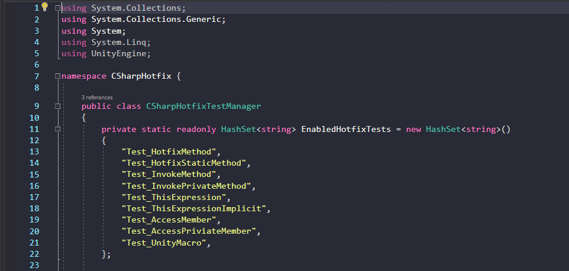
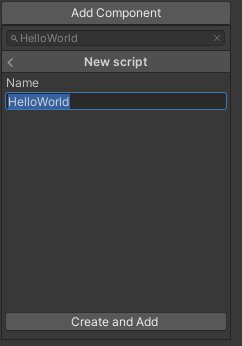

# Unity-CSharpHotfix

A tool support modify c# code when Unity is playing.


## How to Use
### Enable Tool
Unity Toolbar -> CSharpHotfix -> Enable: 


### Hello World
create a new game object:   


create new script named "HelloWorld.cs" and attach it to the game object created before: 
``` csharp
using System.Collections;
using System.Collections.Generic;
using UnityEngine;

public class HelloWorld : MonoBehaviour
{
    void Start()
    {
        Debug.Log("Hello World");
    }
}

```

### First Run
run game, you will see "Hello World" in the console:  
  


### Create Hotfix 
no need stop game, copy "HelloWorld.cs" to path: 
```YOUR_PROJECT/CSharpHotfix/HelloWorld.cs```

and modify it: 
``` csharp
using System.Collections;
using System.Collections.Generic;
using UnityEngine;

public class HelloWorld : MonoBehaviour
{
    void Start()
    {
        Debug.Log("Hello World (hotfixed)");
    }
}
```

### Use Hotfix
Unity Toolbar -> CSharpHotfix -> Hotfix:


### See Result
duplicate "HelloWorld" gameobject in the hierarchy (or copy & paste it), it will create a new gameobject:   
  

and you will see "Hello World (hotfixed)" in the console:  
  

## How to Use in Other Project
Copy ```Plugin``` and ```CSharpHotfix``` folder to your Unity project.  


## Limitations
There're many limitations when use this tool: 

### Unity Version
this tool depends on [Roslyn](https://github.com/dotnet/roslyn) which required .NET framework 4.x or newer.  
but Unity old version like Unity 5.6 only have .NET framework 3.5, which is not supported.  
we only test it on Unity 2019, but 2018 is supported in theory.  
so please use Unity version after 2018.  

### Cannot Debug
as we will modify the .dll files when enable tool, you can't debug after then.  
For example, break points in visual studio will never been triggered. 

### Only Support Method 
you can only hotfix method which is already declared in old c# codes. new class/methd/member will be ignored.

### Bugs
as a simple tool just created for testing, it hasn't been test enough. 

## Run Tests
we have a few simple test cases included, just click the "Run Tests" button in SampleScene, you can see the different result before and after hotfix.  

### Before Hotfix
  

### After Hotfix
  

### Add new test cases
#### create test
if you need add new test cases, just create files to path: 
```Assets/CSharpHotfix/Tests/```  
and  
```YOUR_PROJECT/CSharpHotfix/Tests/```  

#### add to test list
and add you test class to ```CSharpHotfixTestManager```:  
  


#### write code
make sure your test class contains a method named 'Fund': 
``` csharp
namespace CSharpHotfixTest {
    public class Test_HotfixMethod
    {
        public string Func()
        {
            return "hello";
        }
    }
}
```
and ```Func``` need return ```"hello"``` in origin code, return ```"hotfixed"``` in hotfix code, cause we use this to check hotfix is successful or not.


## Known issues

### Error when use "Create and Add" when AddComponent
  

after adding/removeing/editing a C# script, we'll triggered a compilation, and after that, modify the ```Assembly-CSharp.dll``` file.  
but "Create and Add" will directly use script before our modifications, it caused an error which cannot use the new created script.  
so if using this tool, please manually create script, and then add it to game object.


### Dll Error
sometimes unknown operation may cause dll error (like "Create and Add" error claimed before), to fix it, you should do:  
1. disable CSharpHotfix tool
2. restart Unity
3. Unity Toolbar -> CSharpHotfix -> Force Recompile  
   

## License
WTF