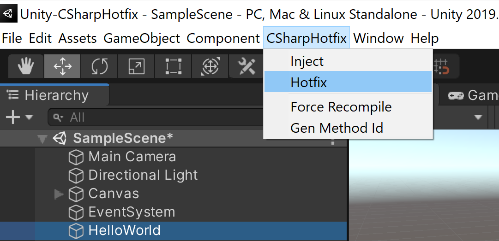

# CSharpHotfix

A tool support modify c# code when Unity is playing.


## How-to-Use
### Enable Tool
Unity Toolbar -> CSharpHotfix -> Enable: 


### Hello World
create a new game object with new script named "Hello World":   


### Edit Hello World
``` csharp
using System.Collections;
using System.Collections.Generic;
using UnityEngine;

public class HelloWorld : MonoBehaviour
{
    void Start()
    {
        Debug.Log("Hello World");
    }
}

```

### First Run
run game, you will see "Hello World" in the console:  
  


### Create Hotfix 
no need stop game, copy "HelloWorld.cs" to path: 
```YOU_PROJECT/CSharpHotfix/HelloWorld.cs```

and modify it: 
``` csharp
using System.Collections;
using System.Collections.Generic;
using UnityEngine;

public class HelloWorld : MonoBehaviour
{
    void Start()
    {
        Debug.Log("Hello World (hotfixed)");
    }
}
```

### Use Hotfix
Unity Toolbar -> CSharpHotfix -> Hotfix:


### See Result
duplicate "HelloWorld" gameobject in the hierarchy (or copy & paste it), it will create a new gameobject:   
  

and you will see "Hello World (hotfixed)" in the console:  
  


## Limited
There're many limitations when use this tool: 
* **Cannot Debug**: as we will modify the .dll files when enable tool, you can't debug after then. For example, break points in visual studio will never be triggered. 
* **Only Support Method**: you can only hotfix method which is already declared in old c# codes. new class/methd/member will be ignored.
* **Bugs**: as a simple tool just created for testing, it hasn't been test enough.


## Run Tests
we have a few simple test cases included, just click the "Run Tests" button in SampleScene, you can see the different result before and after hotfix.  

### Before Hotfix
  

### After Hotfix
  
